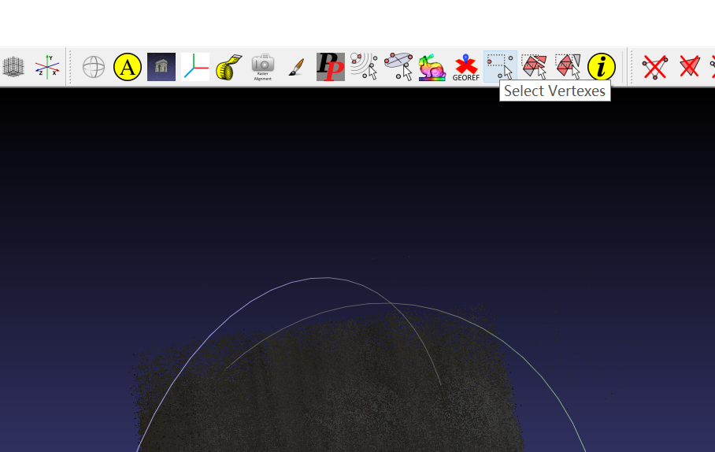
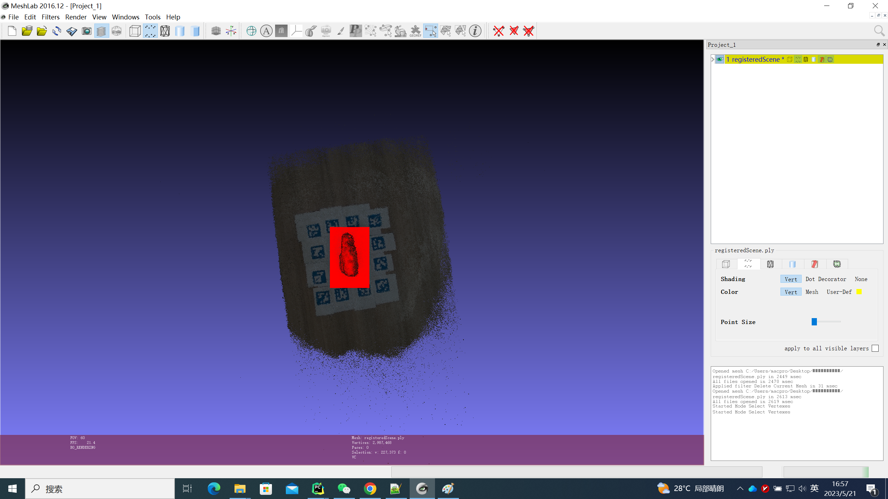
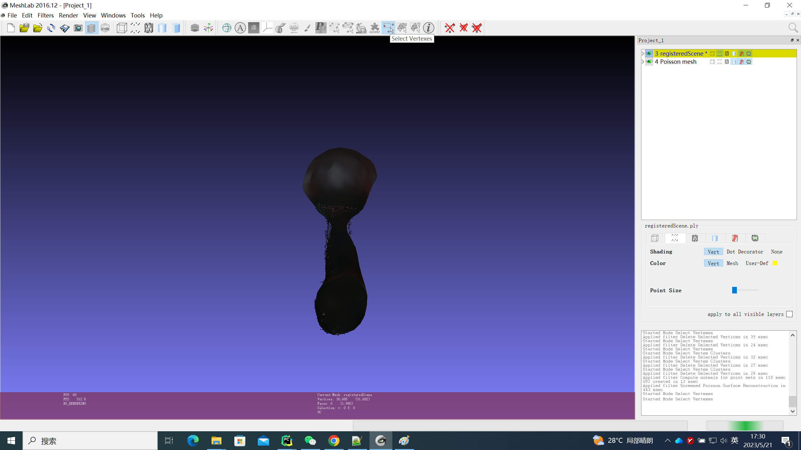
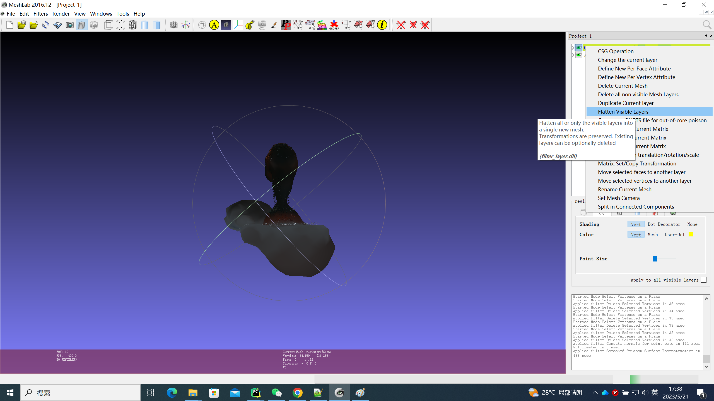

# 对象数据集工具

## 介绍

该工具用于6D位姿识别项目，用于创建Linemod数据集。

## 安装

#### Linux版本

 Ubuntu  和 Python 2.7 上进行了测试 

#### 第 1步：：

升级任何预安装包

```
sudo apt-get update
sudo apt-get upgrade
```

#### 第 2 步：

通过 apt-get 安装所需的包

```
sudo apt-get install build-essential cmake git pkg-config libssl-dev libgl1-mesa-glx
```

#### 第 3 步：

为保护计算机运行环境，我们使用anaconda配置python环境

```
# 下载 Anaconda3
wget https://repo.anaconda.com/archive/Anaconda3-5.2.0-Linux-x86_64.sh
# 添加执行权限
chmod +x Anaconda3-5.2.0-Linux-x86_64.sh
# 执行安装
./Anaconda3-5.2.0-Linux-x86_64.sh

#如下是安装过程
Welcome to Anaconda3 5.2.0

In order to continue the installation process, please review the license
agreement.
Please, press ENTER to continue
>>>  #直接回车


THIS SOFTWARE IS PROVIDED BY THE COPYRIGHT HOLDERS AND CONTRIBUTORS "AS IS" AND 
ANY EXPRESS OR IMPLIED WARRANTIES, INCLUDING, BUT NOT LIMITED TO, THE IMPLIED WA
RRANTIES OF MERCHANTABILITY AND FITNESS FOR A PARTICULAR PURPOSE ARE DISCLAIMED.
--More--  #按q

THIS SOFTWARE IS PROVIDED BY THE COPYRIGHT HOLDERS AND CONTRIBUTORS "AS IS" AND 
ANY EXPRESS OR IMPLIED WARRANTIES, INCLUDING, BUT NOT LIMITED TO, THE IMPLIED WA
RRANTIES OF MERCHANTABILITY AND FITNESS FOR A PARTICULAR PURPOSE ARE DISCLAIMED.

Do you accept the license terms? [yes|no]
[no] >>>  #输入yes

Anaconda3 will now be installed into this location:
/home/macpro/anaconda3

  - Press ENTER to confirm the location
  - Press CTRL-C to abort the installation
  - Or specify a different location below

[/home/whi/anaconda3] >>>  #直接回车

Do you wish the installer to prepend the Anaconda3 install location
to PATH in your /home/macpro/.bashrc ? [yes|no]
[no] >>>  #输入yes

Visual Studio Code License: https://code.visualstudio.com/license

Do you wish to proceed with the installation of Microsoft VSCode? [yes|no]
>>>  #输入no

### 安装完毕 关闭终端 重新打开一个终端
### 创建python2.7虚拟环境
conda create -n ObjectDatasetTools python=2.7

#进入虚拟环境
source activate ObjectDatasetTools

#安装相关库 （备注：这里使用我的库版本 官网给的安装命令存在版本问题）
pip3 install numpy Cython==0.19 pypng scipy==1.3.3 scikit-learn open3d==0.9.0 scikit-image tqdm pykdtree==1.3.1 opencv-python==3.3.0.10 opencv-contrib-python==3.3.0.10  trimesh==2.38.24 -i https://pypi.tuna.tsinghua.edu.cn/simple

pip install pyrealsense2 -i https://pypi.tuna.tsinghua.edu.cn/simple
```


#### windows版本

windows 和 Python 2.7 上进行了测试  (笔者使用的是 windows 版本)

跟linux类似直接下载 Anaconda3的windos版本

```
下载
https://repo.anaconda.com/archive/Anaconda3-5.2.0-Windows-x86_64.exe

### 创建python2.7虚拟环境
conda create -n ObjectDatasetTools python=2.7

#进入虚拟环境
conda activate ObjectDatasetTools

#安装相关库 （备注：这里使用我的库版本 官网给的安装命令存在版本问题）
pip3 install numpy Cython==0.19 pypng scipy==1.3.3 scikit-learn open3d==0.9.0 scikit-image tqdm pykdtree==1.3.1 opencv-python==3.3.0.10 opencv-contrib-python==3.3.0.10  trimesh==2.38.24 -i https://pypi.tuna.tsinghua.edu.cn/simple

pip install pyrealsense2 -i https://pypi.tuna.tsinghua.edu.cn/simple
```


## 在自定义项目上创建数据集

### 一、准备工作

**在 arucomarkers 文件夹中使用正确大小的 aruco 标记（ID 1-13）彩色**打印 pdf。如图所示，在感兴趣的对象周围粘贴标记，确保您没有带有重复 IDS 的标记。


### 二. 使用深度相机生成彩色图跟深度图

#### 选项 1：使用深度相机生成图片（笔者使用的是D455相机）

```python
python record2.py LINEMOD/OBJECTNAME
```

例如，

```python
python record2.py LINEMOD/sugar
```

记录一个糖盒的序列。默认情况下，脚本会在倒计时 5 秒后录制 40 秒。您可以更改录制间隔或按“q”退出录制。请稳步移动相机以获得物体的不同视图，同时保持相机视野内随时有 2-3 个标记。

请注意，该项目假设所有图片都保存在名为“LINEMOD”的文件夹下，使用其他文件夹名称会导致出现错误。

如果您使用 record2.py 创建图片，彩色图与深度图对齐以及相机参数将自动保存在序列目录下。

#### 选项 2：使用现有图像或使用其他深度相机

如果您使用的是其他相机，请将彩色图像 (.jpg) 放在名为“JPEGImages”的文件夹中，并将对齐的**深度**图像（uint16 pngs 在 8m 范围内插值）放在“depth”文件夹中。请注意，该算法假定深度图像与彩色图像对齐。从0.jpg，1.jpg ... 600.jpg和相应的深度图像按顺序命名你的彩色图像为0.png ... 600.png，你还应该在序列目录下创建一个文件intrinsics.json并以如下格式手动输入相机参数：

{"fx": 614.4744262695312, "fy": 614.4745483398438, "height": 480, "width": 640, "ppy": 233.29214477539062, "ppx": 308.8282470703125, "ID": "620201000292"}

如果你不知道你的相机的内在，你可以粗略估计。所有需要的参数都是 fx，fy，cx，cy，其中通常 fx = fy 等于图像的宽度，cx 和 cy 是中心的形象。例如，对于 640 x 480 分辨率的图像，fx、fy = 640、cx = 320、cy = 240。

一个示例序列可以[在这里](https://drive.google.com/file/d/1BnW4OMR0UlIsaFAjeBuPWrbDgmqV-AY-/view?usp=sharing)下载，创建一个名为“LINEMOD”的目录，解压示例序列，并将解压缩的文件夹（计时器）放在 LINEMOD 下。

### 三.获取帧变换

在指定的间隔（间隔可以在 config/registrationParameters 中更改）针对第一帧计算帧的变换，将变换（4 * 4 同质变换）保存为 numpy 数组（.npy）。

```python
python compute_gt_poses.py LINEMOD/sugar  
```

### 四.注册所有帧并为注册场景创建网格。

```python
python register_scene.py LINEMOD/sugar
```

原始的 registeredScene.ply 将保存在指定目录下（例如，LINEMOD/sugar）。registeredScene.ply 是场景的注册点云，包括桌面、标记和扫描期间暴露的任何其他对象，并进行了一定程度的噪声消除。生成的网格看起来像这样，需要在第 5 步中进行手动处理：


或者，您可以尝试通过使用 register_segmented 而不是 register_scene 来跳过所有手动操作。（这个效果极差 笔者使用的是register_scene 手动处理注册点云）

```python
python register_segmented.py LINEMOD/sugar
```

默认情况下，register_segmented 尝试删除所有不需要的背景并执行表面重建，将注册的点云转换为三角形网格。如果 MESHING 设置为 false，脚本将仅尝试移除背景并使用平坦表面自动完成看不见的底部（如果 FILLBOTTOM 设置为 true），您将需要执行第 5 步。

但是，register_segmented 可能会失败，因为它使用一些特殊的方法来分割背景，因此您可能需要调整一些参数才能使其与您的对象一起使用。要调整的最重要的旋钮是“MAX_RADIUS”，它会切断任何深度读数，其欧几里得到观察到的 aruco 标记中心的距离长于指定值。此值当前设置为 0.2 m，如果您有更大的对象，您可能需要增加此值以不切断对象的部分。运行 register_segmented 的结果如下所示：


### 五.手动处理注册的点云（可选）

** 如果您对运行 register_segmented 的结果满意，可以跳过第 五 步。**

注册的点云需要处理为

1. 删除不感兴趣的背景，

   

   

   

   

   

   

   

   

   

   

   

   

   

   

   

   

   

   

   

2. 执行表面重建并完成缺失的一侧，反之亦然，

   

   

   

   

   

   

   

   

   

   

   

   

   

3. 处理重建的网格（您可能需要切掉部分并重新完成缺失的一侧），

   

   

   

   

   

   

   

   

   

   

   

   

   

   

   

   

   

   

   

   

   

4. 确保处理后的网格没有任何孤立的噪音，并保存模型。

   

   

   

   

   

   

   

   

   

最终产品是三角形网格，而不是算法生成的注册点云。


可以查看我录制的[这个](https://www.youtube.com/watch?v=BPX-j9xE2EQ)非常基础的教程。

如果您将网格创建为副产品以获得图像蒙版，或将其用于 singleshotpose 等项目。只需要精确的网格几何形状，而外观没有用。因此，对于平面区域，如视频中所示“封闭孔洞”是可以接受的。另外，对于对称的物体，通过对称手动完成形状。如果您需要缺失面的确切纹理信息，您将需要拍摄另一个序列来暴露缺失面并手动对齐 2 个点云。

### 六. 创建图像遮罩和标签文件

完成所有自定义对象的步骤 1-4 后，运行

```python
python create_label_files.py all
```

or 

```python
python create_label_files.py LINEMOD/sugar
```

此步骤创建一个名为 foldername.ply（例如 sugar.ply）的新网格，其 AABB 以原点为中心并且与 OBB 具有相同的尺寸。它还会生成图像蒙版（保存在蒙版下）、关于新网格的 4 x 4 均匀变换（保存在变换下）以及标签文件（保存在标签下），这些文件是对象的 3D 边界框投影到二维图像。掩码文件可用于深度学习项目（例如，mask-rcnn）的训练和测试目的

通过运行以下命令直观地检查创建的 3D 边界框和蒙版的正确性：


```python
python inspectMasks.py LINEMOD/sugar
```

### （可选）创建 singleshotpose 所需的附加文件

如果为单镜头姿势创建网格文件，则需要在 meshlab 中打开这些新网格文件，然后通过取消选中二进制格式选项再次保存它们。这些网格被 singleshotpose 用于评估和姿势估计目的，并且 singleshotpose 无法读取二进制编码的网格。

在第 6 步中创建的蒙版和标签与 singleshotpose 兼容。目前，类标签的分配方式很古怪（例如，按照文件夹在所有序列文件夹中的抓取顺序），如果您为每个文件夹调用 create_label，它们将被分配相同的标签，因此请阅读打印输出并更改类标签手动在 create_label_files.py 中。

此外，您需要创建训练图像和测试图像

```python
python makeTrainTestfiles.py
```

并创建其他所需的路径文件

对于每个自定义对象，在 cfg 文件夹中创建一个 objectname.data 文件

要获取对象比例（最大顶点距离），您可以运行

```python
python getmeshscale.py
```

这应该是为 singleshotpose 创建自定义数据集所需的一切，请不要忘记更新 singleshotpose 中的相机校准参数。

### （可选）为对象检测项目创建边界框标签

完成第 6 步（生成图像遮罩）后。跑步：

```python
python get_BBs.py
```

这将创建 annotations.csv，其中包含 LINEMOD 文件夹下所有图像的类标签和边界框信息。
